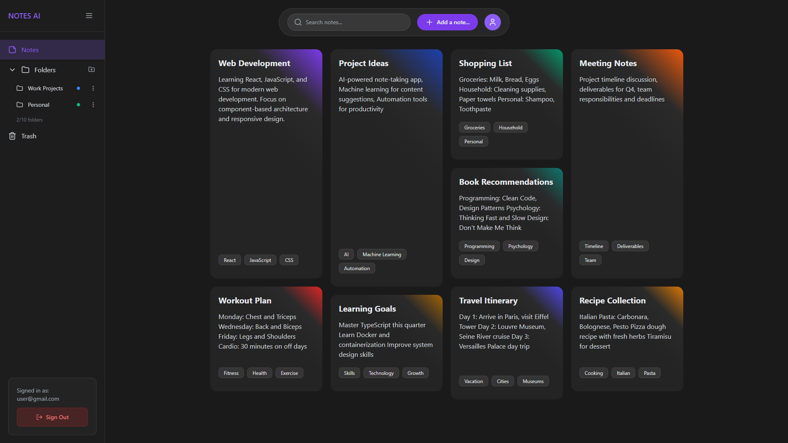
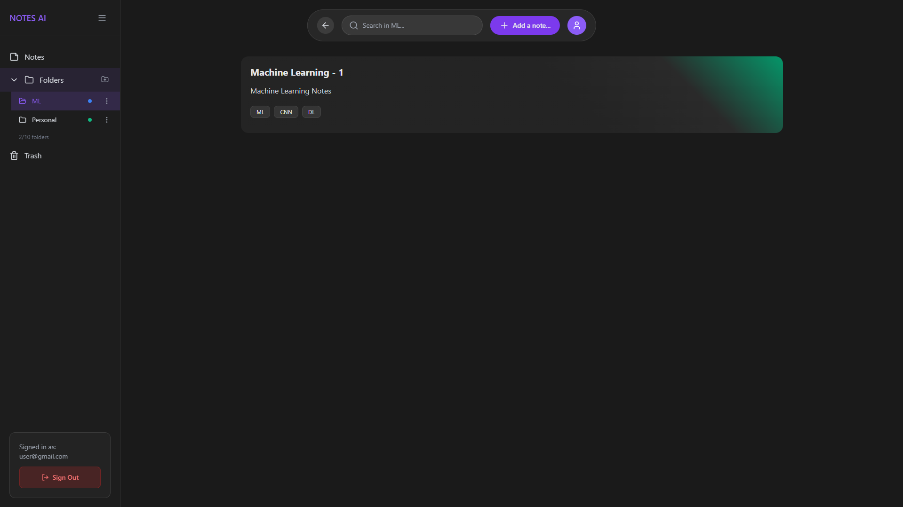

# 🤖✨ AI Notes - Your Intelligent Note-Taking Companion

<div align="center">
  
  [](https://ainotesai.vercel.app/)
  [](https://reactjs.org/)
  [](https://vercel.com/)
  [](https://ai.google.dev/)
</div>

---

## 🌟 Experience the Future of Note-Taking

**AI Notes** is a revolutionary note-taking application that combines beautiful design with artificial intelligence to transform how you capture, organize, and interact with your thoughts. Built with modern web technologies, it offers an intuitive interface powered by Google's Gemini AI.

### 🚀 [**Try it Live →**](https://ainotesai.vercel.app/)

---

## ✨ Key Features

### 📝 **Smart Note Creation**
- **Rich Text Editor** with formatting tools (Bold, Italic, Lists, etc.)
- **Image Support** - Drag, drop, or paste images directly
- **Auto-Save** functionality to never lose your work
- **Customizable Colors** for visual organization

### 🗂️ **Intelligent Organization**
- **Folder System** - Organize notes into custom folders (up to 10)
- **Smart Search** - Find notes by title, content, or keywords
- **Drag & Drop** reordering for perfect organization
- **Keyword Tagging** system (up to 3 per note)

### 🤖 **AI-Powered Assistant**
- **Chat with Your Notes** - Ask questions about your content
- **Content Analysis** - Get insights and suggestions
- **Split-Screen Interface** - Edit notes while chatting with AI
- **Powered by Google Gemini** for intelligent responses

### 🎨 **Beautiful Design**
- **Dark Theme** with purple accents for comfortable viewing
- **Responsive Layout** - Works perfectly on all devices
- **Smooth Animations** and transitions throughout
- **Glassmorphism UI** elements for a modern look

### 🗃️ **Note Management**
- **Trash System** - Safely delete and restore notes
- **Multiple Note Sizes** - Small, Medium, and Large layouts
- **Grid View** with masonry-style arrangement
- **Quick Actions** - Edit, delete, or open with AI

---

## 🛠️ Built With Modern Technologies

<div align="center">

| Technology | Purpose | Version |
|------------|---------|---------|
| ⚛️ **React** | Frontend Framework | 18.x |
| 🎨 **Tailwind CSS** | Styling & Design | 3.x |
| 🤖 **Google Gemini AI** | AI Assistant | Latest |
| ⚡ **Vercel** | Deployment Platform | - |
| 🌐 **JavaScript ES6+** | Core Language | Latest |

</div>

---

## 🎯 How to Use AI Notes

### 1. **Getting Started**
1. Visit [ainotesai.vercel.app](https://ainotesai.vercel.app/)
2. Sign up with your email or use Google authentication
3. Start creating your first note!

### 2. **Creating Notes**
- Click the **"Add a note..."** button
- Choose a color and add keywords
- Write your content with rich formatting
- Add images by dragging, dropping, or pasting

### 3. **Organizing Content**
- Create folders for different topics
- Use the search bar to find specific notes
- Drag and drop to reorder notes
- Tag notes with relevant keywords

### 4. **AI Interaction**
- Click **"Open with AI"** on any note
- Ask questions about your content
- Get suggestions and insights
- Edit your note while chatting

---

## 🚀 Quick Start for Developers

Want to run this project locally? Here's how:

### Prerequisites
- Node.js (16.x or higher)
- npm or yarn
- Google Gemini API key

### Installation

```bash
# Clone the repository
git clone https://github.com/yourusername/ai-notes-app.git

# Navigate to project directory
cd ai-notes-app

# Install dependencies
npm install

# Create environment file
cp .env.example .env

# Add your Gemini API key to .env
REACT_APP_GEMINI_API_KEY=your_api_key_here

# Start development server
npm start
```

### 🌐 Deployment

This project is configured for easy deployment on Vercel:

```bash
# Install Vercel CLI
npm i -g vercel

# Deploy to Vercel
vercel --prod
```

---

## 📱 Screenshots & Features

<div align="center">

### 🏠 **Main Notes Dashboard**

*Your central hub with all notes in a beautiful bento-style grid layout*

### 📁 **Folder Organization System**

*Dedicated folder view showing only folder-specific notes for better organization*

### 🤖 **AI Chat Interface**

*Side by side split Notes and AI chatbot interface where you can chat with your notes and edit at the same time*

### 🎯 **Drag & Drop Magic**

*Effortlessly reorganize your notes with smooth drag & drop while maintaining the beautiful grid*

</div>

---

## 🎨 Design Philosophy

### **Dark Theme First**
- Designed for extended use with reduced eye strain
- Purple accent colors for a modern, professional look
- Glassmorphism effects for depth and elegance

### **User Experience Focus**
- Intuitive navigation and interactions
- Smooth animations and micro-interactions
- Responsive design for all screen sizes
- Keyboard shortcuts for power users

### **Performance Optimized**
- Fast loading times with optimized bundle size
- Efficient re-rendering with React best practices
- Progressive image loading
- Minimal API calls with smart caching

---

## 🔮 Future Enhancements

- 🔐 **Advanced Authentication** - Multi-factor authentication
- ☁️ **Cloud Sync** - Real-time synchronization across devices  
- 📊 **Analytics Dashboard** - Usage insights and note statistics
- 🌍 **Collaboration** - Share and collaborate on notes
- 📱 **Mobile App** - Native iOS and Android applications
- 🎙️ **Voice Notes** - Speech-to-text functionality
- 🔍 **Advanced Search** - Full-text search with filters
- 📤 **Export Options** - PDF, Markdown, and more formats

---

## 🤝 Contributing

We welcome contributions! Here's how you can help:

1. **Fork** the repository
2. **Create** a feature branch (`git checkout -b feature/AmazingFeature`)
3. **Commit** your changes (`git commit -m 'Add some AmazingFeature'`)
4. **Push** to the branch (`git push origin feature/AmazingFeature`)
5. **Open** a Pull Request

### 📋 Areas We Need Help With
- 🐛 Bug fixes and improvements
- 🎨 UI/UX enhancements
- 📱 Mobile responsiveness
- 🧪 Testing and QA
- 📚 Documentation

---

## 📞 Support & Feedback

<div align="center">

### Love AI Notes? Here's how to support us:

[](https://github.com/yourusername/ai-notes-app)


</div>

### 📧 Contact
- **Email**: tejas22538@iiitd.ac.in
- **Demo Website**: [ainotesai.vercel.app](https://ainotesai.vercel.app/)


---

## 📄 License

This project is licensed under the MIT License - see the [LICENSE.md](LICENSE.md) file for details.

---

<div align="center">

### 🌟 **Ready to Transform Your Note-Taking?**

[](https://ainotesai.vercel.app/)

---

**Made with ❤️ by [Tejas Jaiswal](https://github.com/tejasj228)**

*AI Notes - Where Intelligence Meets Organization*

</div>
