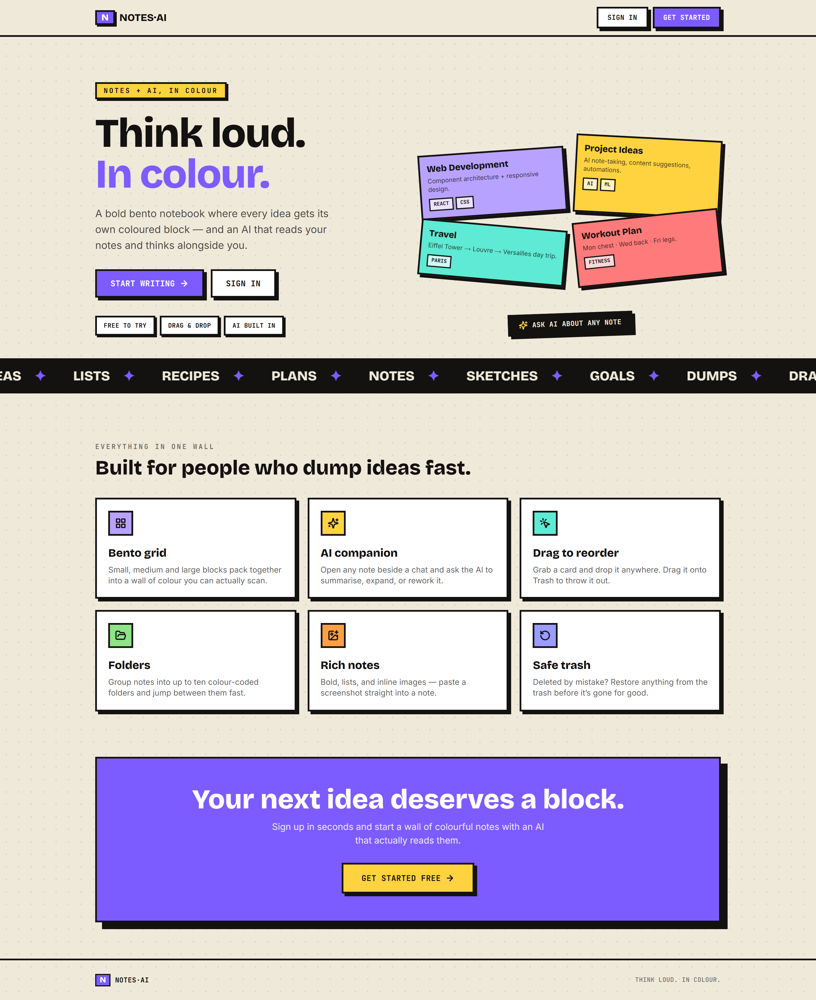
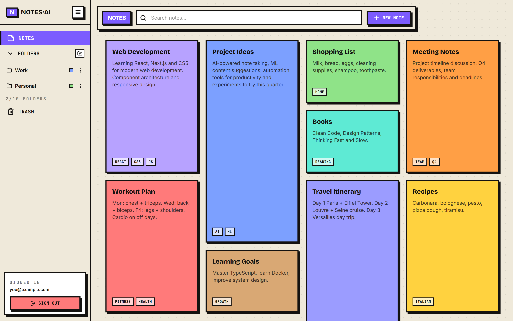
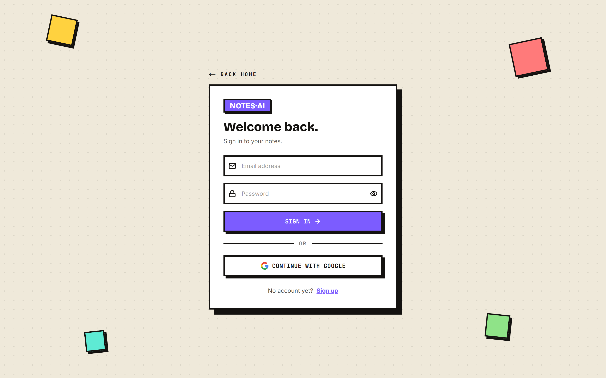

# 🤖✨ AI Notes - Your Intelligent Note-Taking Companion

<div align="center">
  
  [](https://notes-ai-gules.vercel.app/)
  [](https://nextjs.org/)
  [](https://vercel.com/)
  [](https://ai.google.dev/)
</div>

---

## 🌟 Experience the Future of Note-Taking

**AI Notes** is a revolutionary note-taking application that combines beautiful design with artificial intelligence to transform how you capture, organize, and interact with your thoughts. Built with modern web technologies, it offers an intuitive interface powered by Google's Gemini AI.

### 🚀 [**Try it Live →**](https://notes-ai-gules.vercel.app/)

---

## ✨ Key Features

### 📝 **Smart Note Creation**
- **Rich Text Editor** with formatting tools (Bold, Italic, Lists, etc.)
- **Image Support** - Drag, drop, or paste images directly
- **Auto-Save** functionality to never lose your work
- **Customizable Colors** for visual organization

### 🗂️ **Intelligent Organization**
- **Folder System** - Organize notes into custom folders (up to 10)
- **Smart Search** - Find notes by title, content, or keywords
- **Drag & Drop** reordering for perfect organization
- **Keyword Tagging** system (up to 3 per note)

### 🤖 **AI-Powered Assistant**
- **Chat with Your Notes** - Ask questions about your content
- **Content Analysis** - Get insights and suggestions
- **Split-Screen Interface** - Edit notes while chatting with AI
- **Powered by Google Gemini** for intelligent responses

### 🕸️ **Knowledge Graph (GraphRAG)**
- **Triplet extraction** - notes are auto-distilled into `(subject → relation → object)` facts on save
- **Connected graph** - facts link across notes when they share entities (people, places, concepts…)
- **Smarter AI answers** - questions retrieve the relevant subgraph (semantic embeddings + graph hops) so the AI can pull facts from *related* notes, not just the open one
- **Visual graph view** - an interactive force-directed network at `/graph` to explore how your notes connect

### 🎨 **Beautiful Design**
- **Neo-Brutalist theme** — warm paper canvas, thick ink borders, hard shadows
- **Landing page** for signed-out visitors
- **Responsive Layout** - Works perfectly on all devices
- **Bento grid** of vivid colour blocks

### 🗃️ **Note Management**
- **Trash System** - Safely delete and restore notes
- **Multiple Note Sizes** - Small, Medium, and Large layouts
- **Grid View** with masonry-style arrangement
- **Quick Actions** - Edit, delete, or open with AI

---

## 🛠️ Built With Modern Technologies

<div align="center">

| Technology | Purpose | Version |
|------------|---------|---------|
| ▲ **Next.js** | Full-stack framework (App Router + API routes) | 15.x |
| ⚛️ **React** | UI Library | 19.x |
| 🎨 **Tailwind CSS** | Styling & Design | 3.x |
| 🧱 **Neo-Brutalism** | Design language | — |
| 🍃 **MongoDB + Mongoose** | Database | Atlas |
| 🔐 **JWT** | Auth tokens | — |
| 🤖 **Google Gemini AI** | Chat + triplet extraction + embeddings | Latest |
| 🕸️ **GraphRAG** | Knowledge-graph retrieval (in MongoDB) | — |
| ⚡ **Vercel** | Single deployment (UI + API) | - |

</div>

> **Architecture:** The app was migrated from Create React App to **Next.js (App Router)** and redesigned in a **light neo-brutalist** theme (warm paper canvas, thick ink borders, hard offset shadows) while keeping the signature bento grid. The original Express backend was ported into **Next.js API routes** (`src/app/api/*`) with serverless-safe MongoDB — so the whole thing is **one Vercel deployment**. Routes: `/`, `/auth`, `/notes`, `/trash`, `/folder/[folderId]`, `/ai-chat/[noteId]`, `/graph`, plus `/api/*`. A landing page is served at `/` for signed-out visitors.
>
> **Knowledge graph:** notes are distilled into `(subject, relation, object)` triplets (Gemini JSON mode) and stored as `entities` + `triplets` (with 768-d embeddings) in the same Atlas cluster. At question time the AI chat retrieves the relevant subgraph — semantic cosine search over triplet embeddings plus a 1-hop expansion through shared entities — and injects a compact “Known facts” block into the prompt, so answers can draw on *related* notes. Works out-of-the-box (in-app cosine); an Atlas Vector Search index can be added for scale (see [DEPLOYMENT.md](DEPLOYMENT.md)). (The standalone `backend/` folder is now legacy.)
>
> **▶ To deploy from scratch, see [DEPLOYMENT.md](DEPLOYMENT.md).**

---

## 🎯 How to Use AI Notes

### 1. **Getting Started**
1. Visit [notes-ai-gules.vercel.app](https://notes-ai-gules.vercel.app/)
2. Sign up with your email or use Google authentication
3. Start creating your first note!

### 2. **Creating Notes**
- Click the **"New note"** button
- Choose a color and add keywords
- Write your content with rich formatting
- Add images by dragging, dropping, or pasting

### 3. **Organizing Content**
- Create folders for different topics
- Use the search bar to find specific notes
- Drag and drop to reorder notes
- Tag notes with relevant keywords

### 4. **AI Interaction**
- Click **"Open with AI"** on any note
- Ask questions about your content
- Get suggestions and insights
- Edit your note while chatting

---

## 🚀 Quick Start for Developers

Want to run this project locally? Here's how:

### Prerequisites
- Node.js (18.x or higher)
- A MongoDB connection string (MongoDB Atlas free tier works great)
- A Google Gemini API key (for AI chat)

### Setup

```bash
# Install dependencies
npm install

# Create your env file and fill in the values
cp .env.example .env.local
```

`.env.local` needs:

```bash
MONGODB_URI=mongodb+srv://...      # your MongoDB connection string
JWT_SECRET=<long-random-string>    # node -e "console.log(require('crypto').randomBytes(48).toString('hex'))"
JWT_EXPIRE=30d
GEMINI_API_KEY=...                 # from https://aistudio.google.com/apikey
```

```bash
# Start the dev server (UI + API together) → http://localhost:3000
npm run dev

# Production build + start
npm run build
npm start
```

There is **no separate backend to run** — the API is served from `src/app/api/*`.
For a full step-by-step deploy (MongoDB Atlas → Gemini → Vercel), see
**[DEPLOYMENT.md](DEPLOYMENT.md)**.

### 🌐 Deployment

This project is configured for easy deployment on Vercel:

```bash
# Install Vercel CLI
npm i -g vercel

# Deploy to Vercel
vercel --prod
```

---

## 📱 Screenshots

<div align="center">

### 🏠 Landing Page


*Signed-out visitors get a bold neo-brutalist landing page — big type, a bento collage of colour blocks, and clear calls to action.*

### 🗂️ Notes Dashboard (Bento Grid)


*The signature wall of notes: small / medium / large blocks in solid colours with thick ink borders, hard offset shadows, keyword tags, folders in the sidebar, and drag-to-reorder / drag-to-trash.*

### 🔐 Sign In / Sign Up


*Email/password and Google sign-in on a clean brutalist card, with playful floating sticker accents.*

</div>

---

## 🎨 Design Philosophy

### **Neo-Brutalism**
- Warm paper canvas (`#EFE9DA`) with a dotted-grid texture
- Thick ink borders (`3px`) and hard offset drop-shadows on every block
- Vivid solid note colours as flat blocks with black text
- Bricolage Grotesque display type + JetBrains Mono labels
- Pressable buttons that shift and collapse their shadow on click

### **User Experience Focus**
- Intuitive navigation and interactions
- Smooth animations and micro-interactions
- Responsive design for all screen sizes
- Keyboard shortcuts for power users

### **Performance Optimized**
- Fast loading times with optimized bundle size
- Efficient re-rendering with React best practices
- Progressive image loading
- Minimal API calls with smart caching

---

## 🔮 Future Enhancements

- 🔐 **Advanced Authentication** - Multi-factor authentication
- ☁️ **Cloud Sync** - Real-time synchronization across devices  
- 📊 **Analytics Dashboard** - Usage insights and note statistics
- 🌍 **Collaboration** - Share and collaborate on notes
- 📱 **Mobile App** - Native iOS and Android applications
- 🎙️ **Voice Notes** - Speech-to-text functionality
- 🔍 **Advanced Search** - Full-text search with filters
- 📤 **Export Options** - PDF, Markdown, and more formats

---

## 🤝 Contributing

We welcome contributions! Here's how you can help:

1. **Fork** the repository
2. **Create** a feature branch (`git checkout -b feature/AmazingFeature`)
3. **Commit** your changes (`git commit -m 'Add some AmazingFeature'`)
4. **Push** to the branch (`git push origin feature/AmazingFeature`)
5. **Open** a Pull Request

### 📋 Areas We Need Help With
- 🐛 Bug fixes and improvements
- 🎨 UI/UX enhancements
- 📱 Mobile responsiveness
- 🧪 Testing and QA
- 📚 Documentation

---

## 📞 Support & Feedback

<div align="center">

### Love AI Notes? Here's how to support us:

[](https://github.com/yourusername/ai-notes-app)


</div>

### 📧 Contact
- **Email**: tejas22538@iiitd.ac.in
- **Demo Website**: [notes-ai-gules.vercel.app](https://notes-ai-gules.vercel.app/)


---

## 📄 License

This project is licensed under the MIT License - see the [LICENSE.md](LICENSE.md) file for details.

---

<div align="center">

### 🌟 **Ready to Transform Your Note-Taking?**

[](https://notes-ai-gules.vercel.app/)

---

**Made with ❤️ by [Tejas Jaiswal](https://github.com/tejasj228)**

*AI Notes - Where Intelligence Meets Organization*

</div>
